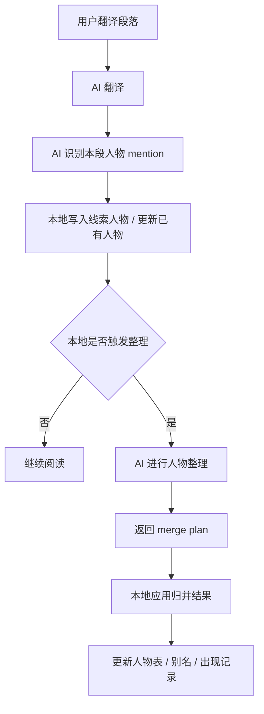
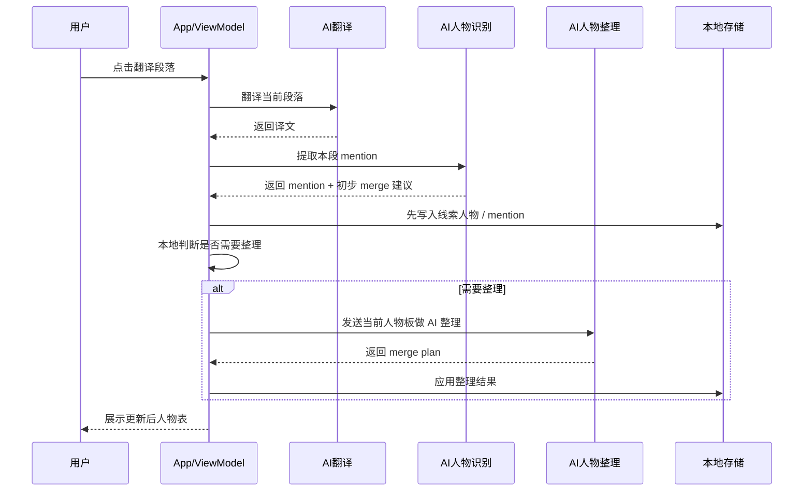

# 人物整理技术方案

## 目标

- 人物表允许先展示阶段性线索，例如 `The girl Egg`。
- 后续当文本出现更强证据时，例如 `Egg Lytton Gore`，系统可以自动把线索人物整理为更准确的人物实体。
- 最终人物表尽量以“人名”为主，昵称、爵位、身份、描述性称呼作为补充信息保留。
- 对确实没有名字、但有阅读价值的人物，保留为描述型人物，例如“一个牧羊人”。

## 核心思路

- 每次翻译后，不直接把所有新称呼都视为最终人物。
- 系统先新增或更新“线索人物/暂定人物”，保证用户能看到阅读过程中逐渐揭示的信息。
- 本地代码只负责判断“现在是否值得触发一次 AI 整理”。
- 真正的人物归并、主名选择、旧线索回收，由 AI 统一完成。

## 数据分层

```text
正文中的称呼
-> mention（一次具体提及）
-> 线索人物 / 暂定人物
-> AI 整理
-> 最终人物实体
```

- `mention`
  - 一次具体称呼，例如 `Sir Charles`、`The girl Egg`、`Egg Lytton Gore`
- `线索人物`
  - 当前还不能完全确认身份，但值得先展示给用户的条目
- `最终人物实体`
  - AI 整理后的人物结果，优先展示真实姓名

## 主流程



## 时序图



## 触发整理的原则

- `强证据触发`
  - 出现更完整的称呼，例如全名、`昵称 + 姓氏`、`头衔 + 姓名`
- `冲突触发`
  - 人物表里存在明显可能重复、但又尚未合并的条目
- `手动触发`
  - 用户点击“重整人物”

## 责任划分

- `本地代码负责`
  - 收集 mention
  - 维护线索人物
  - 判断是否触发整理
  - 存储最终结果
  - 更新 UI

- `AI 负责`
  - 判断哪些人物其实是同一个人
  - 选择最终主显示名
  - 把昵称、爵位、描述性称呼整理为别名或线索
  - 在证据足够时，把旧线索人物并回真实人物

## 典型案例

```text
第 52 段:
The girl Egg
-> 先作为线索人物展示

第 58 段:
Egg Lytton Gore
-> 命中强证据触发
-> AI 整理后合并到 Miss Hermione Lytton Gore
-> “The girl Egg” 保留为其旧称呼 / 线索来源
```

## 当前版本落地范围

- 已增加 `线索 / 已整理` 两种人物状态。
- 已把“AI 人物整理”独立成单独链路。
- 已在本地加入“强证据 / 冲突触发”策略。
- 已支持在整理后回写人物表、别名和出现记录。

## 后续可继续增强

- 让 AI 输出更结构化的人物资料，例如：
  - 昵称
  - 爵位
  - 身份
  - 性格摘要
  - 与其他角色关系
- 支持“按章节批量整理人物”
- 支持“只整理最近新增的线索人物”
- 支持“人物成长时间线 / 情报揭示过程”
